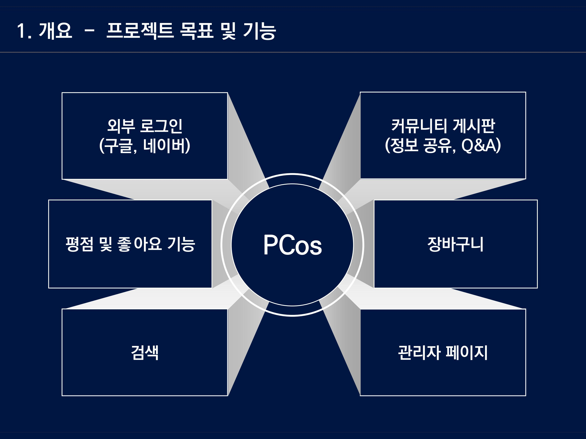
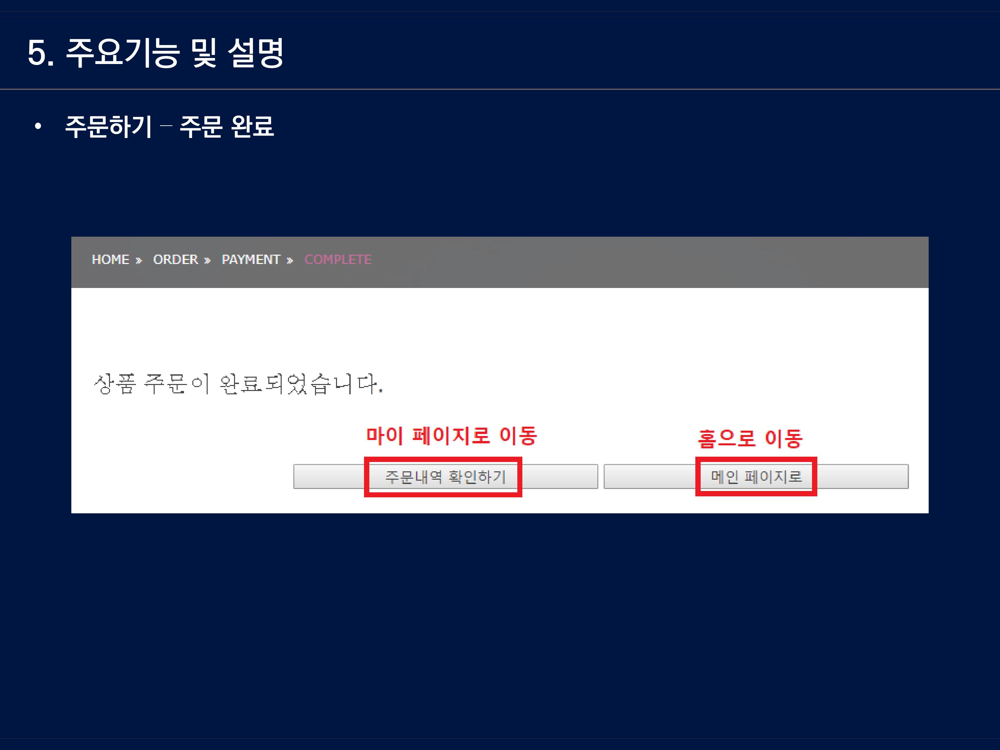

<pre>

site<-"https://www.glowpick.com/brand/ranking?id=34&main_category_id=1&sub_category_id=4"
text<-read_html(site,encoding="UTF-8")
a<-html_nodes(text,".prod-link")
a<-html_attr(a,"href")

cos_myinfo<-NULL
for(i in 1:25){
  b<-a[i]
  url<-paste("https://www.glowpick.com",b,sep="")
  url<-read_html(url,encoding="UTF-8")
  name<-html_nodes(url,".pdt-name")
  name<-html_text(name)
  info<-html_nodes(url,".pdt-info")
  info<-html_text(info)
  brand<-html_nodes(url,".brand-name")
  brand<-html_text(brand)
  dsc<-html_nodes(url,".txt")
  dsc<-html_text(dsc)
  dsc<-gsub("\r\n","",dsc)
  dsc<-gsub("\n","",dsc)
  dsc<-gsub("¢â","",dsc)
  img<-html_nodes(url,".pdt-img img")
  img<-html_attr(img,"src")
  myinfo<-cbind(name,info)
  myinfo<-cbind(myinfo,brand)
  myinfo<-cbind(myinfo,dsc)
  myinfo<-cbind(myinfo,img)
  cos_myinfo<-rbind(cos_myinfo,myinfo)
}
write.csv(cos_myinfo,"cos_skinfood_creamgel.csv")

</pre>
